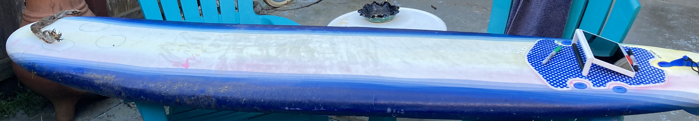

Title: Prototyping Kelp Bed Drone One 
Date: 02024-03-16

# Notes
This morning I started sketching out the components for the kelp bed drone
starting with my and Meghan's shared surf board. 

A couple of weeks ago I was on the Linda Del Mar Beach and I picked
up a piece of dried kelp that had part of the hold-fast and part of 
the stem. I'm using this dried kelp to get a sense of what size I 
need to make the SOU (Species Occurrence Unit) for the drone.  Here is
a side view of the drone with the Kelp hold-fast in one of the sketched
SOU at the top of the drone.

I drew the 
green circles on the drone top using this kelp as reference. Below is an
example of what it would possible look like growing from SOU:

