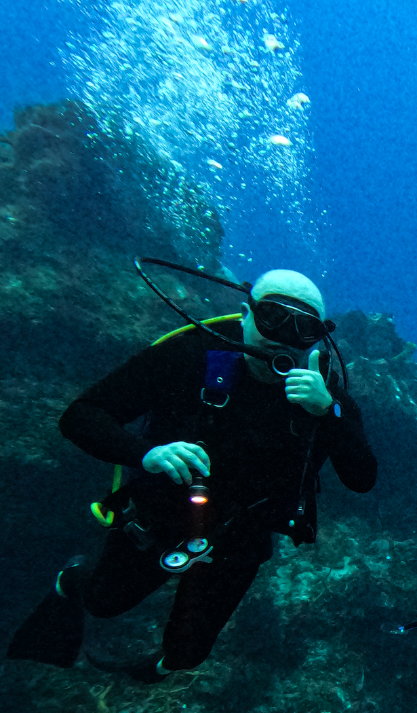
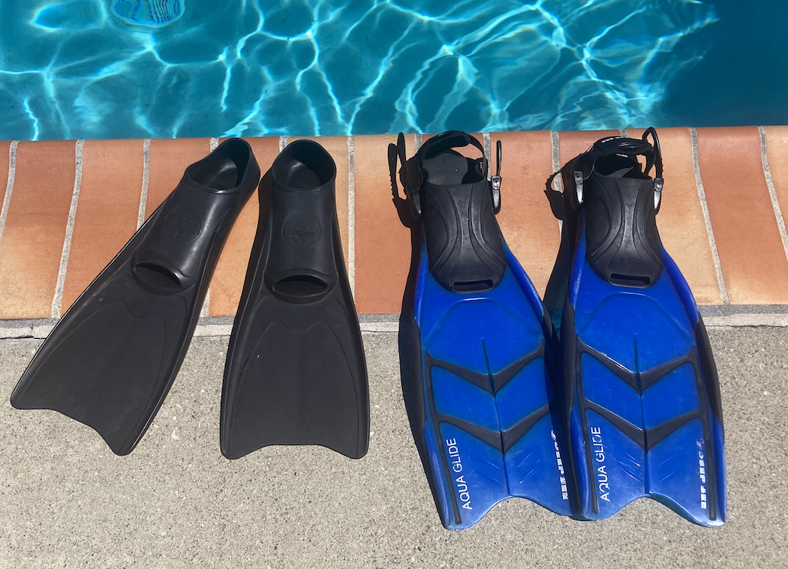

Title: Equipment and Farmer training
keywords: mask, snorkel, fins

As any aspiring farmer, I need to train and improve personal
equipment. In Kelp Farming, my mask, snorkel, and fins are 
critical for survival and daily operations.

The blue pair of fins I purchased and used in my 02018 scuba diving
trip to Maui and didn't have any complaints.

During the pandemic, I often went to the downtown Colorado Springs 
YMCA pool to swim laps and use my gear, including the blue fins.
From [ScubaPro](https://scubapro.johnsonoutdoors.com/us), I
my main mask and snorkel and a [black pair of fins](https://scubapro.johnsonoutdoors.com/us/shop/fins/rubber-fin)
full foot design. 

Last September my wife re-certified her scuba diving certification 
and was doing her evaluation dives in Monterey Bay. On the second day,
a Sunday, I joined her for the dives and was my first time diving into 
Kelp beds. My current neoprene booties a too large for the blue fins, so
I rented a pair along with tanks and weights from [Montery Bay Scuba](https://montereybayscuba.com/).

On the second dive, I was falling behind the group as we moved through the 
giant kelp near the pier and my left fin unbuckled and started drifting 
away. At about 9.1 meters (30 feet) I kicked over, sat down on the bottom,
first controlling my breathing, then got both of my fins on and totally 
lost the group and my dive and life partner. I ascend to the top among 
the giant kelp and got initially tangled, and then waited until the group
surfaced with the divemaster and instructor. We then continued the dive.

In December, Melissa and I went for a dive vacation in Cozumel and I had
the best dives of my life. Here is a photo from the last dive of the vacation:

I used the black fins as you can see. They were adequate for the dives but
I need more kick power with a full wetsuit.

## Today's Evaluation and Training

 
